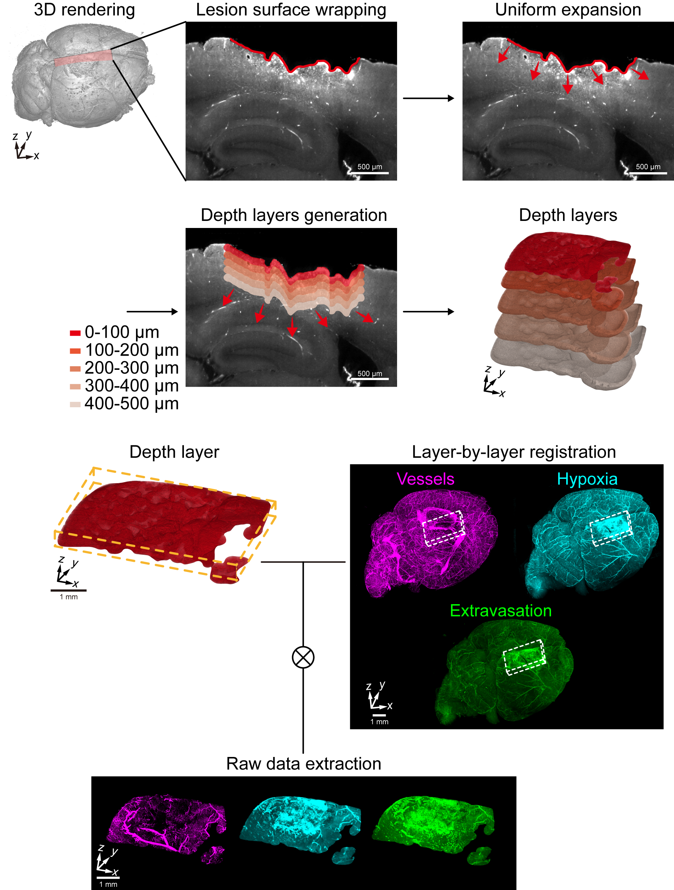
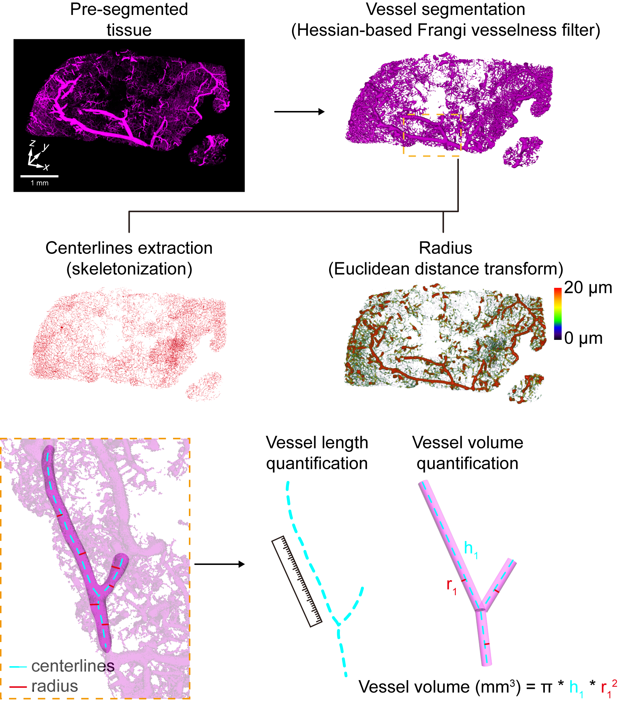
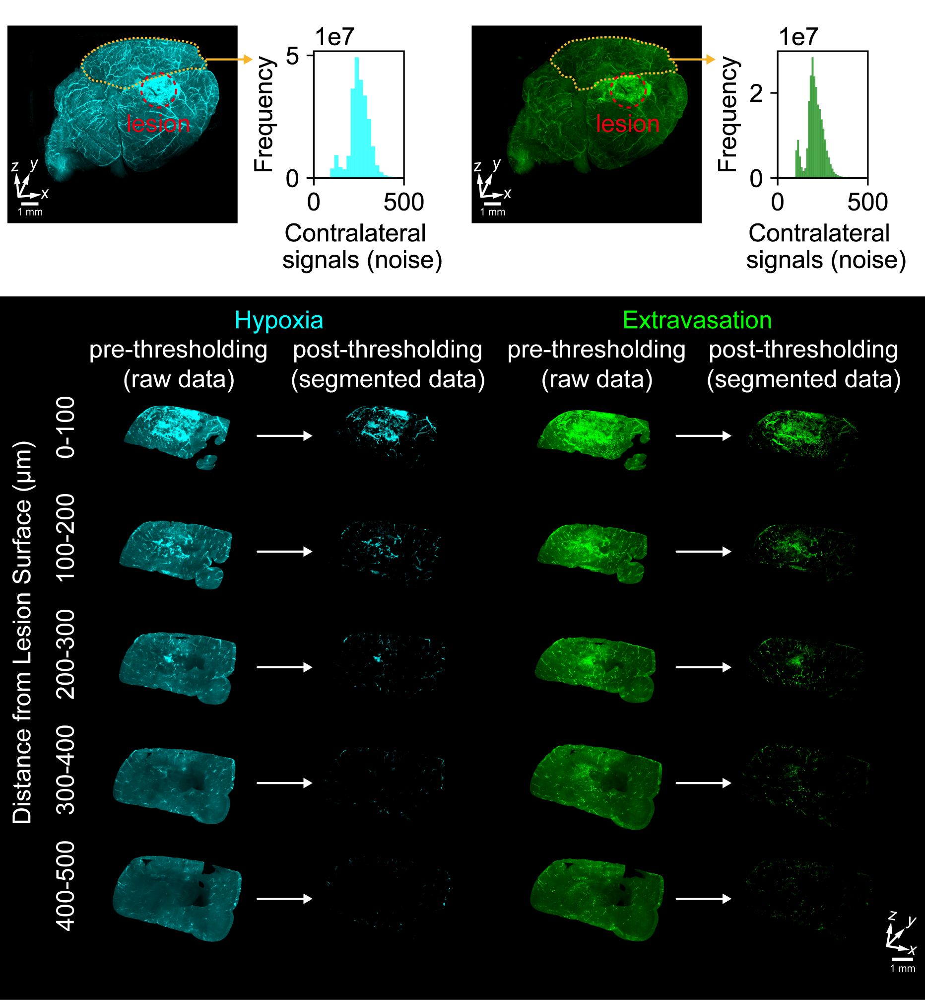
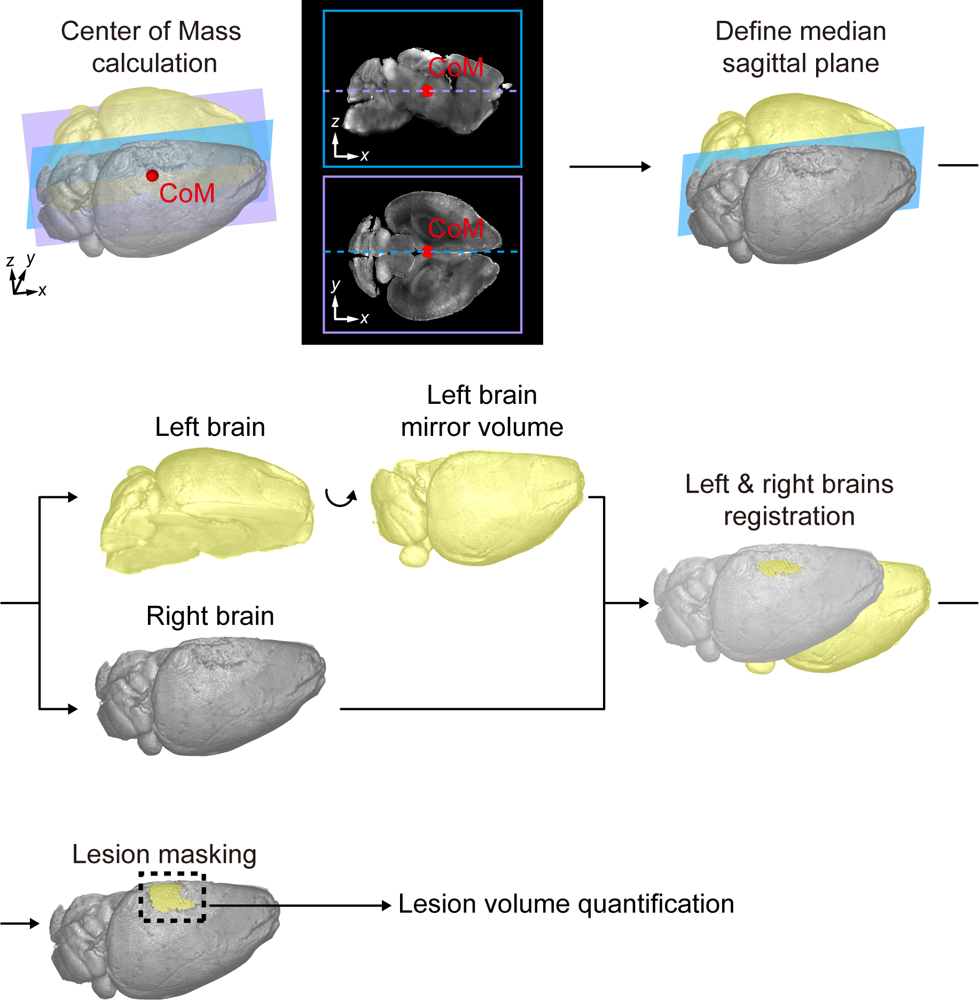

# TBI-Analysis

This repository contains a 3D Slicer-based [https://github.com/Slicer/Slicer] image processing pipeline designed specifically for the analysis of traumatic brain injury in murine models. For more detailed information, please refer to the accompanying publication.

*Placeholder for the citation.*

## Depth Layer Generation
1. **Surface Wrapping**  
   The lesion surface is delineated using a surface wrapping technique, as described in [`Layer-by-layer_Analysis/surface_wrapping.ipynb`](Layer-by-layer_Analysis/surface_wrapping.ipynb). This method is adapted from the approach presented in [Slicer-SurfaceWrapSolidify](https://github.com/sebastianandress/Slicer-SurfaceWrapSolidify).

2. **Uniform Expansion and Depth Layer Registration**  
   The delineated lesion surface is uniformly expanded to generate depth layers. These layers are co-registered across different channels in the raw 3D datasets, as described in [`Layer-by-layer_Analysis/depth-layers_segmentation.ipynb`](Layer-by-layer_Analysis/depth-layers_segmentation.ipynb). Data from each depth layer are extracted for subsequent segmentation and analysis.

## Vessel Segmentation and Quantitative Analysis
1. **Vessel Segmentation**  
   Vessel segmentation is performed on the raw dataset using a Hessian-based Frangi vesselness filter, as described in [`Vessel_Analysis/vessel_segmentation.ipynb`](Vessel_Analysis/vessel_segmentation.ipynb).

2. **Vessel Quantification**  
   Vessel features such as branch points, centerlines, radii, and tortuosity are extracted in [`Vessel_Analysis/vessel_quantification.ipynb`](Vessel_Analysis/vessel_quantification.ipynb). Metrics such as total vessel length and total vessel volume are then calculated from these features.

## Hypoxia and Extravasation Signal Segmentation and Quantitative Analysis
Thresholds for segmenting hypoxia and extravasation signals are determined by analyzing contralateral regions (the regions opposite to the injured hemisphere). A histogram-based approach using percentiles is applied to determine these thresholds, as demonstrated in [`Useful_functions/volume_sum.py`](Useful_functions/volume_sum.py).

## Lesion Masking and Quantitative Analysis
Lesion masking is performed by subtracting the volume of the right hemisphere from the mirrored volume of the left hemisphere, as detailed in [`Lesion_Analysis/Lesion_masking.ipynb`](Lesion_Analysis/Lesion_masking.ipynb).

## Sample Datasets
The sample datasets provided represent a section of a mouse brain imaged using a custom-built light-sheet microscope developed in the Biophotonics Molecular Imaging Laboratory at the University of Washington.
